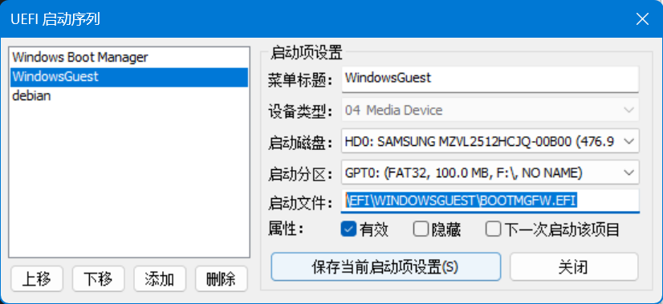

# 使用虚拟硬盘实现 Windows 多系统启动

<!-- more -->

使用 VHDX 虚拟硬盘制作一个 Windows 双系统，在启动时可以发挥全部机器性能，并且与磁盘中系统相互独立，互不影响。

这里仅介绍以 UEFI 启动的电脑制作步骤，传统 BIOS 启动的电脑在引导时略有不同，详情见官网:[启动到虚拟硬盘：将 VHDX 或 VHD 添加到启动菜单](https://learn.microsoft.com/zh-cn/windows-hardware/manufacture/desktop/boot-to-vhd--native-boot--add-a-virtual-hard-disk-to-the-boot-menu?view=windows-11)

### 1. 创建 VHDX 

以管理员身份启动命令行程序，打开 diskpart
```powshell
diskpart

# 创建并准备新的 VHDX。这里在D盘创建了一个100GB固定大小的VHDX。
create vdisk file=D:\windows.vhdx maximum=102400 type=fixed

# 附加 VHDX。 这会将 VHDX 作为磁盘添加到主机上的存储控制器。
attach vdisk

# 创建分区，对其进行格式化，并为其分配驱动器号后退出 diskpart
create partition primary
format quick label=vhdx
assign letter=v
exit
```

### 2. 将 Window 映像部署到 VHDX
```powshell
Dism /Apply-Image /ImageFile:install.wim /index:1 /ApplyDir:V:\
```

### 3. 为系统引导分区分配驱动器号
```powshell
# 进入 diskpart
diskpart

# 查看当前磁盘卷
DISKPART> list volume

卷    ###   LTR   标签         FS     类型        大小     状态       信息
----------  ---  -----------  -----  ----------  -------  -------  --------
卷     0     C   本地磁盘       NTFS   磁盘分区     476 GB   正常      启动
卷     1                      NTFS   磁盘分区      712 MB   正常      已隐藏
卷     2     D   本地磁盘       NTFS   磁盘分区     1671 GB  正常
卷     3                      FAT32  磁盘分区      499 MB   正常      系统
卷     4     E                ReFS   磁盘分区      499 GB   正常
卷     5     F   Ventoy       exFAT  可移动        57 GB    正常
卷     6                             可移动        32 MB    正常

# 选择 FAT32 格式的系统分区
select volume 3
assign letter="S"
exit
```

### 4. 添加将新系统添加为可选启动项
```powshell
V:
cd v:\windows\system32
bcdboot v:\windows /s S: /f UEFI
```

### 5. 常见问题

#### 启动到 VHDX 时，引导失败无法启动系统
**可能是由于系统找不到磁盘驱动器**

方案一：将 IRST 驱动程序或者 AHCI 驱动手动注入到 VHDX 磁盘中，根据电脑型号在官网找对应磁盘驱动程序，然后使用 Dism++ 注入驱动。

方案二：在 BIOS 中关闭 Intel Volume Management Device (VMD) 技术
> 注：关闭VMD技术将会导致您的电脑无法使用 RAID 磁盘阵列


### 为双系统添加单独的 UEFI 启动项

这里使用 EasyUEFI 和 BOOTICE 编辑和修改启动项，Windows 系统下也可以使用其他工具。

在第4步中，添加了将新系统添加为可选启动项后，首先使用 EasyUEFI 进入 EFI 系统分区资源管理器，将 Windows 启动项文件夹全部拷贝出来，命名为 WinGuest，使用 BOOTICE 编辑 WinGuest/Boot/BCD 文件，删除当前系统启动项，只保留 vhdx 启动项。


> 对于当前系统，依次打开 “系统配置”-“引导”选项，删除 vhdx 磁盘启动项即可。
> 

然后将 WinGuest 文件夹使用 EasyUEFI 上传 EFI 系统分区中，再打开"管理EFI启动项"菜单，添加一条新的启动项，选择 /EFI/WinGuest/Boot/bootmgfw.efi 作为引导文件即可。




